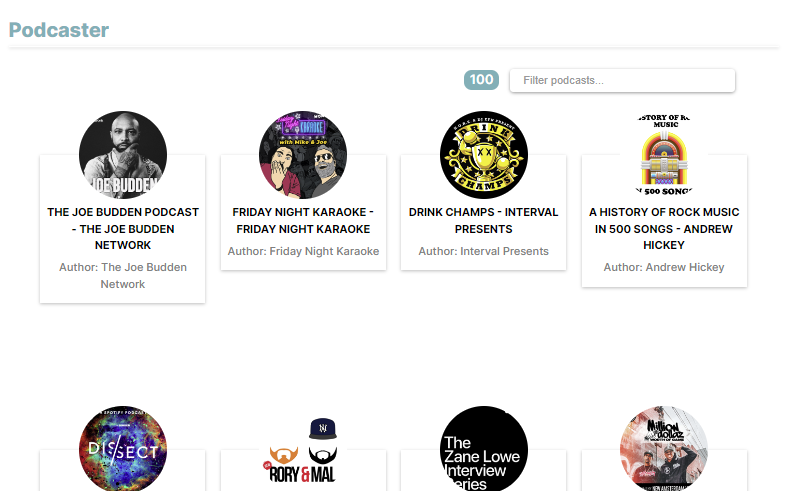

# Music Podcasts App



A simple and elegant web application for discovering and enjoying your favorite music podcasts.

## Table of Contents

- [About](#about)
- [Features](#features)
- [Getting Started](#getting-started)
  - [Prerequisites](#prerequisites)
  - [Installation](#installation)
- [Usage](#usage)
- [Development](#development)
- [Testing](#testing)
- [Deployment](#deployment)
- [Contributing](#contributing)
- [License](#license)

## About

The Music Podcasts App is a web application built with React and Vite that allows users to explore a wide range of music podcasts. Whether you're a music enthusiast or just looking for some good tunes, this app has you covered.

## Features

- Browse and search for music podcasts.
- Listen to episodes directly within the app.

## Getting Started

### Prerequisites

Before you begin, ensure you have met the following requirements:

- Node.js 18.18.0 installed
- npm or yarn (recommended) package manager

### Installation

To get the Music Podcasts App up and running, follow these steps:

1. Clone the repository:

   ```bash
   git clone https://github.com/PacoGD/music-podcasts.git
   cd music-podcasts
   ```

2. Install dependencies:

   ```bash
      yarn install
      # or
      npm install
   ```

### Usage

1. To start the development server, run:

   ```bash
      yarn dev
      # or
      npm run dev

   ```

## Development

During development, you can run the following scripts:

- `yarn dev`: Start the development server.
- `yarn build`: Build the production-ready app.
- `yarn lint`: Run ESLint for code linting.
- `yarn preview`: Preview the production build locally.
- `yarn test`: Run Jest tests.
- `yarn test:watch`: Run Jest tests in watch mode.
- `yarn test:coverage`: Generate Jest test coverage report.

## Deployment

To deploy the app to a production environment, follow the deployment instructions for your hosting platform of choice. Make sure to build the app using `yarn build` or `npm build` before deployment.

## Contributing

Contributions are welcome! If you'd like to contribute to the project, please follow these steps:

1. Fork the repository.
2. Create a new branch for your feature or bug fix.
3. Make your changes and commit them.
4. Push your changes to your fork.
5. Submit a pull request to the main repository.

Please make sure to follow the project's code of conduct and adhere to the coding style.

## License

This project is licensed under the MIT License.

MIT License

Copyright (c) 2023 PacoGD

Permission is hereby granted, free of charge, to any person obtaining a copy
of this software and associated documentation files (the "Software"), to deal
in the Software without restriction, including without limitation the rights
to use, copy, modify, merge, publish, distribute, sublicense, and/or sell
copies of the Software, and to permit persons to whom the Software is
furnished to do so, subject to the following conditions:

The above copyright notice and this permission notice shall be included in all
copies or substantial portions of the Software.

THE SOFTWARE IS PROVIDED "AS IS", WITHOUT WARRANTY OF ANY KIND, EXPRESS OR
IMPLIED, INCLUDING BUT NOT LIMITED TO THE WARRANTIES OF MERCHANTABILITY,
FITNESS FOR A PARTICULAR PURPOSE AND NONINFRINGEMENT. IN NO EVENT SHALL THE
AUTHORS OR COPYRIGHT HOLDERS BE LIABLE FOR ANY CLAIM, DAMAGES OR OTHER
LIABILITY, WHETHER IN AN ACTION OF CONTRACT, TORT OR OTHERWISE, ARISING FROM,
OUT OF OR IN CONNECTION WITH THE SOFTWARE OR THE USE OR OTHER DEALINGS IN THE
SOFTWARE.
